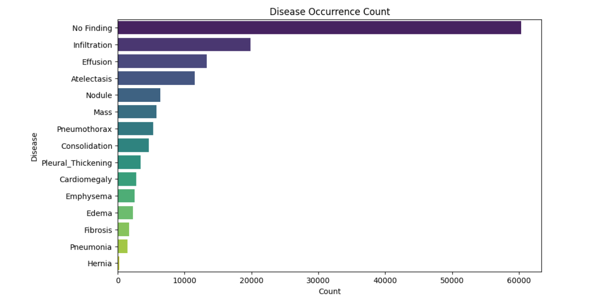
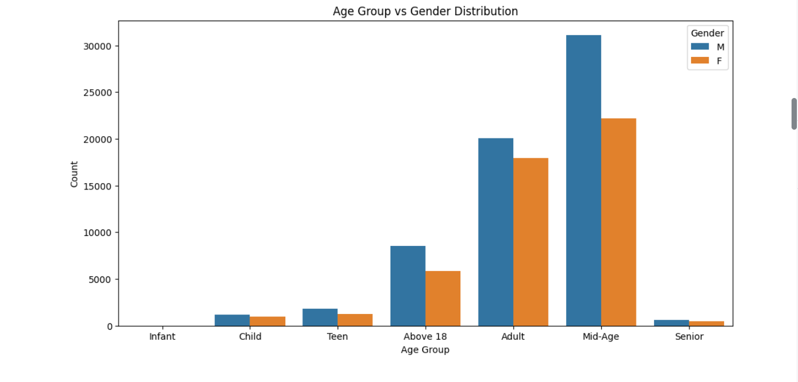
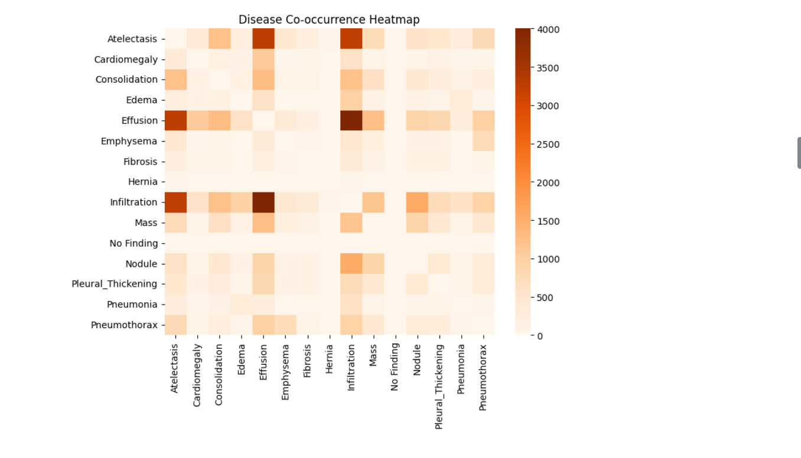
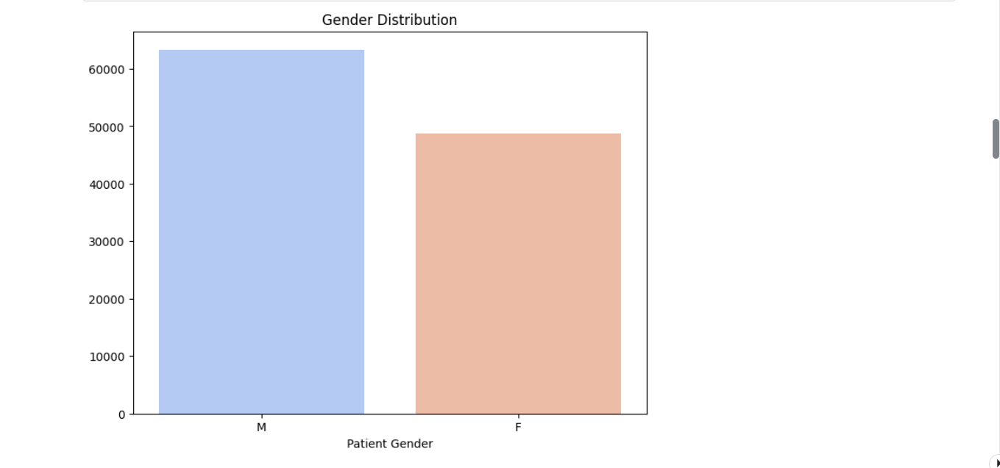
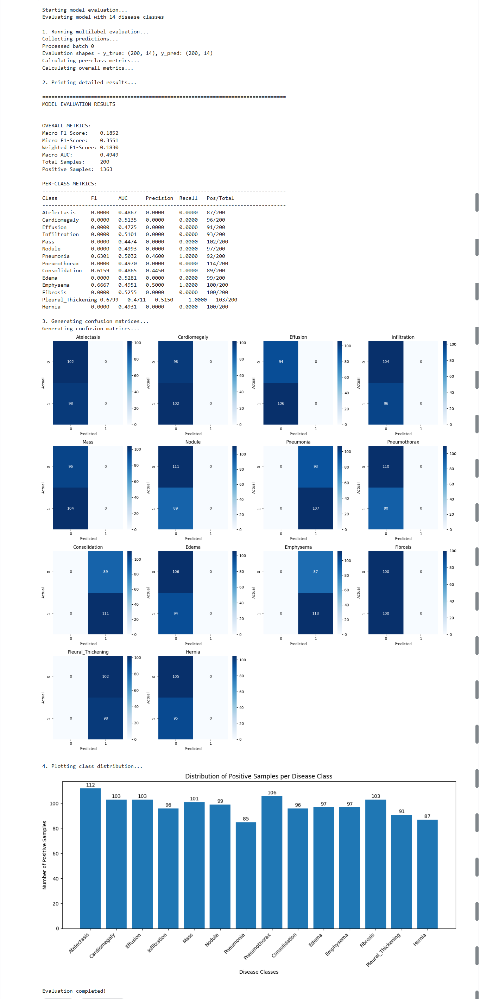
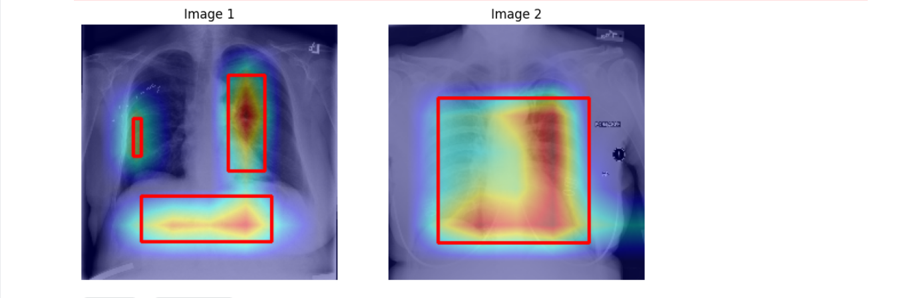
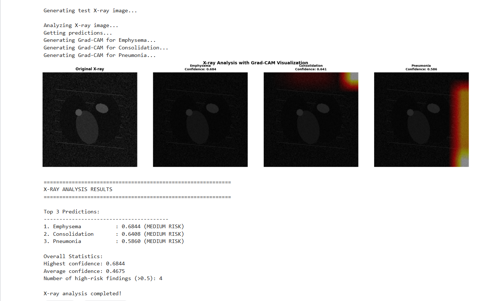

# Chest X-Ray Disease Detection using Deep Learning

## 📌 Overview
This project implements a **multi-label chest X-ray disease classification system** using **Deep Learning and Transfer Learning**.
The model is trained on the **NIH Chest X-Ray dataset (Kaggle)** and is capable of detecting **multiple thoracic diseases from a single X-ray image**.

This project was developed as part of my learning journey in **Artificial Intelligence & Data Science**, with a focus on **medical image analysis and explainable AI**.

---

## 🧠 Key Features
- Multi-label disease classification
- Patient-level train/validation split to prevent data leakage
- Advanced preprocessing using **CLAHE & histogram equalization**
- Data augmentation using **Albumentations and Keras**
- Transfer Learning with **DenseNet121**
- Fine-tuning for improved performance
- Model explainability using **Grad-CAM heatmaps and bounding boxes**

---

## 📊 Dataset
- **Source:** NIH Chest X-Ray Dataset (Kaggle)
- **Images:** Chest X-ray PNG images
- **Labels:** Multi-label disease annotations
- **CSV File:** `Data_Entry_2017.csv`

---

## 📈 Exploratory Data Analysis (EDA)

### 🔹 Disease Occurrence Distribution
Shows the frequency of each disease in the dataset, highlighting strong class imbalance.



---

### 🔹 Age Group vs Gender Distribution
Distribution of patients across different age groups and genders.



---

### 🔹 Disease Co-occurrence Heatmap
Visualizes how often multiple diseases appear together in a single X-ray.



---

### 🔹 Gender Distribution
Overall gender distribution of patients in the dataset.



---

## ⚙️ Model Architecture
- **Base Model:** DenseNet121 (ImageNet pre-trained)
- Global Average Pooling
- Batch Normalization
- Fully Connected Layers with Dropout
- **Output Layer:** Sigmoid activation (multi-label classification)

---

## 📈 Training Strategy
- Binary Cross-Entropy loss with **label smoothing**
- Adam optimizer with learning rate scheduling
- Early stopping and model checkpointing
- Two-phase training:
  - **Warm-up:** Frozen base model
  - **Fine-tuning:** Partial unfreezing of deeper layers

---

## 📊 Model Evaluation Results

### 🔹 Classification Metrics & Confusion Matrices
Includes per-class Precision, Recall, F1-score, AUC, and confusion matrices.



---

## 🔍 Explainability with Grad-CAM

### 🔹 Grad-CAM Heatmaps with Bounding Boxes
Grad-CAM is used to highlight disease-relevant regions in X-ray images.
Bounding boxes are drawn around high-activation areas to improve interpretability.



---

### 🔹 X-ray Prediction with Confidence Scores
Example test X-ray showing **top predicted diseases with confidence levels** and corresponding Grad-CAM visualizations.



---

## 🛠 Technologies Used
- Python
- TensorFlow / Keras
- NumPy & Pandas
- OpenCV
- Albumentations
- Matplotlib & Seaborn
- Jupyter Notebook

---

## ▶️ How to Run
```bash
pip install -r requirements.txt
jupyter notebook chest_xray_multilabel_densenet121.ipynb
